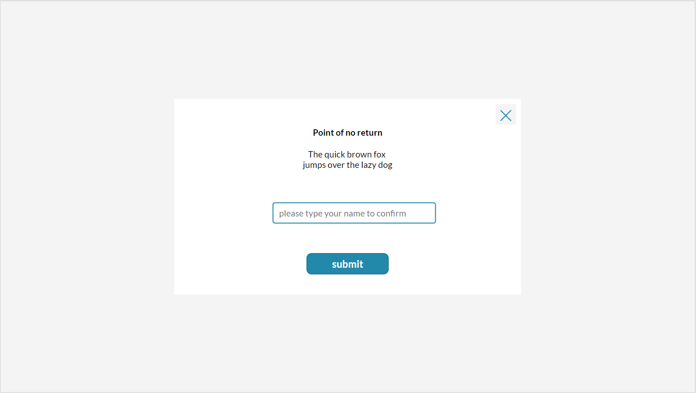
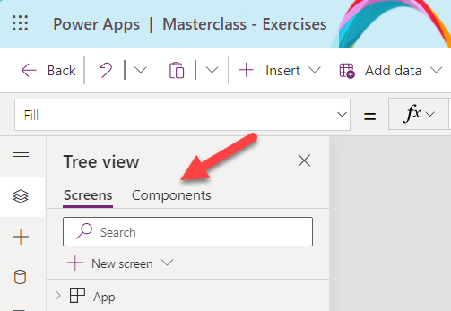
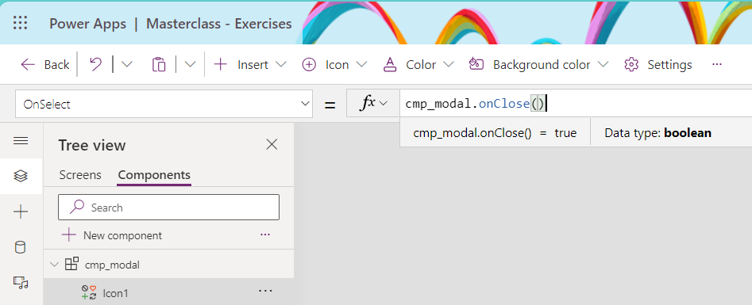
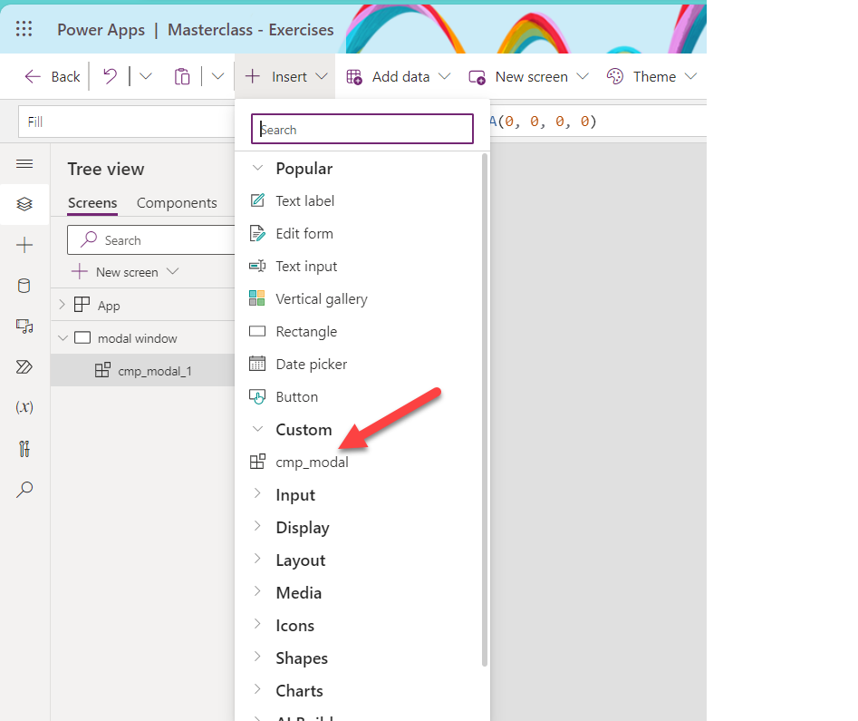
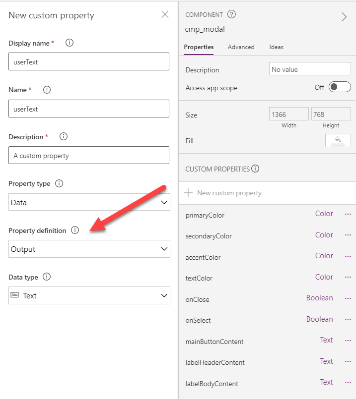

# Build a modal window component

You can build this component in any canvas app, but we also prepared an app for you with the built component so that you can also reverse engineer it. Find it in the canvas app **Masterclass - Exercises** oin the **modal window** screen.

The finished component should look similar to this one:



## Features - understand what the component does

* It greys out the entire screen apart from a white rectangle in the middle where our content sits
* It allows makers to define texts for the title, the body, and the button
* It allows makers to define an event to happen in the **OnSelect** of that button
* it allows users to close the component in the **OnSelect** of the **X** icon
* it allows users to type in their name as a validation

## Create the component

* in the Tree view, select **Components**



* Select **+ New component**


* Give a better name (**F2** is your friend when renaming controls) like `cmp_modal`
* Set the **Width** to `App.Width` and the **Height** to `App.Height`

### Input properties

#### Colors

* Define input properties for the colors you want to use: `primaryColor`, `secondaryColor`, `accentColor`
* Assign your color palette values to them as default values.

💡If you don't know which colors you should choose, take these values:

* **primaryColor**: `RGBA(237, 237, 237, .5)`
* **secondaryColor**: `Color.White`
* **accentColor**: `ColorValue("#FF694B")`
* **textColor**: `Color.Black`
  


<!-- * Create also input properties for radius of buttons, standard width or height of controls you use, and more. The goal is to avoid hard coded values as you don't want to go over the entire component over and over just because someone requests 'just a tiny change' 🙃 -->
💡 If you need some more input on how custom properties work, check out this article: [Canvas component overview](https://learn.microsoft.com/power-apps/maker/canvas-apps/create-component#custom-properties)

#### Content

As we will also want to give makers good options to customize the content being displayed in the component:

Define input properties so that makers can easily adjust these values. You can already change the default value from `"Text"` to:

* **mainButtonContent**: `"Submit"`
* **labelHeaderContent**:  `"Point of no return"`
* **labelBodyContent**: `"The quick brown fox jumps over the lazy dog"`

### Event properties - make your component interact with the app

#### The Close icon

If we now want to interact from our component with our app, like closing the component, we need to create a new property of type **Event**.

💡 Note: If you want to do this, you need to first turn on the respecting setting


⚠️ This type of property was called `Behavior property` in the past, so some docs may still refer to that term.

* Add an **Event** property `onClose` (boolean) to our component


* Add an `X` icon to the component
* Assign the **onClose** event to the **OnSelect** of the `X` icon



* Add the component to your screen.



* In your component instance, set the **onClose** property of your component to `Set(isCmpVisible, false)`
* In your component instance, set the **Visible** property of your component to `iscmpVisible`

As a result, the component will automagically 🦄 disappear, once a user selects that `X` icon.

💡 To test the component, insert a Button on your screen, the **OnSelect** property should be set to `Set(isCmpVisible, true)`

#### The Submit Button

Let's do something similar for the submit Button

* Add an **Event** property `onSelect` (boolean) to our component
* Add a button to the component
* Assign the **onSelect** event to the **OnSelect** of the button
* In the component instance on your screen, define the **onSelect** event of the component: `Set(isCmpVisible, false)`

💡 We could as well inlcude a function to Patch a datasource or similar.

### Pretty up your component

Let's make the component a bit more pretty.

#### Background

* Set **Fill** of the component itself to `cmp_modal.primaryColor`

#### Rectangle as backdrop for the content

* Insert a rectangle, **Width**: `500` and **Height**: `400`
* Set **Fill** to `cmp_modal.secondaryColor`
* Set **X** of the rectangle to `(Parent.Width - Self.Width)/2`
* Set **Y** of the rectangle to `(Parent.Height - Self.Height/2)`

💡 Make sure that this rectangle is always at the very bottom of the component

#### The X icon

* Place the **X** icon in the top right corner of that rectangle with a `10` margin:
  * **X**: `Rectangle1.X + Rectangle1.Width - Self.Width -10`
  * **Y**: `Rectangle1.Y+10`
* Set **Width** of the **X** icon to `24` and **Height** to `Self.Width`

#### The Button

* Place the button:
  * **X**: `Rectangle1.X + (Rectangle1.Width-Self.Width)/2`
  * **Y**: `Rectangle1.Y + Rectangle1.Height-Self.Height-10`
* Set **Text** to `cmp_modal.mainButtonContent`
* Set **Fill** to `cmp_modal.accentColor`

#### Text labels for the content

* Insert two textlabels for title and body, place them:
  * **X**: `Rectangle1.X + (Rectangle1.Width-Self.Width)/2`
  * **Y** of title textlabel: `Rectangle1.Y +30`
  * **Y** of body textlabel: `Label1.Y + Label1.Height +30`
* Set the **Align** : `Align.Center`
* Set **Text** of the title textlabel: `cmp_modal.labelHeaderContent`
* Set **Text** if the body textlabel: `cmp_modal.labelBodyContent`
* Adjust **Width** of body textlabel if needed, set **Auto height**: `true`, if needed

#### The Textinput

We want users to type in their name to acknowledge that they read the information provided on the modal window.

* Insert a Textinput
* Set **Default** to `""`
* Set **Hint text** to `"type in your name to confirm"`

### Output properties - Return values from component to app

If users interact with our components and we want to know *what* they did, we will need to return values from our component to the app. We do this with output properties.

For example, our component contains a TextInput control and we want to know the **Text** property of that in our app, we will need to create an output property, hook that to `TextInput.Text` and then use the Output property in the app to return that value.

* Create an **Output** property in the component of type **Text**.



* Now assign it to Textinput1.Text:


This means, that we can use `cmp_modal.userText` in our app to validate for example against `User().Fullname`. You can try the principle with a textlabel on your screen with a **Text**:

```
If(
    User().FullName = cmp_modal_1.userText,
    "thanks for confirming",
    "you didn't type in the name of the logged in user, please try again"
)
```

## Congrats

You built a modal window component that allows makers to stay flexible with colors, content, and actions of your component.

