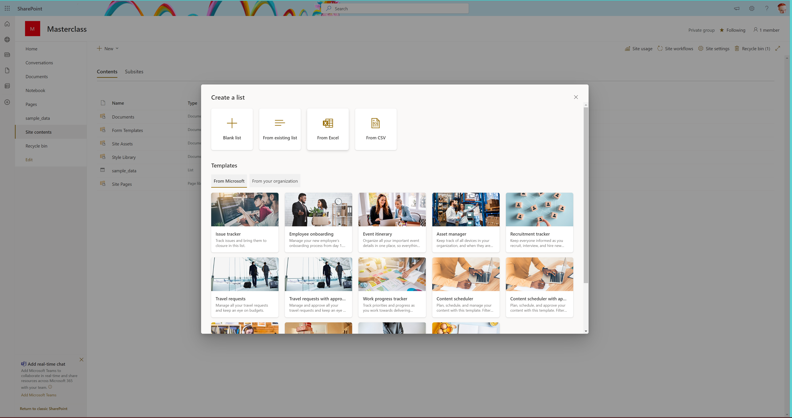
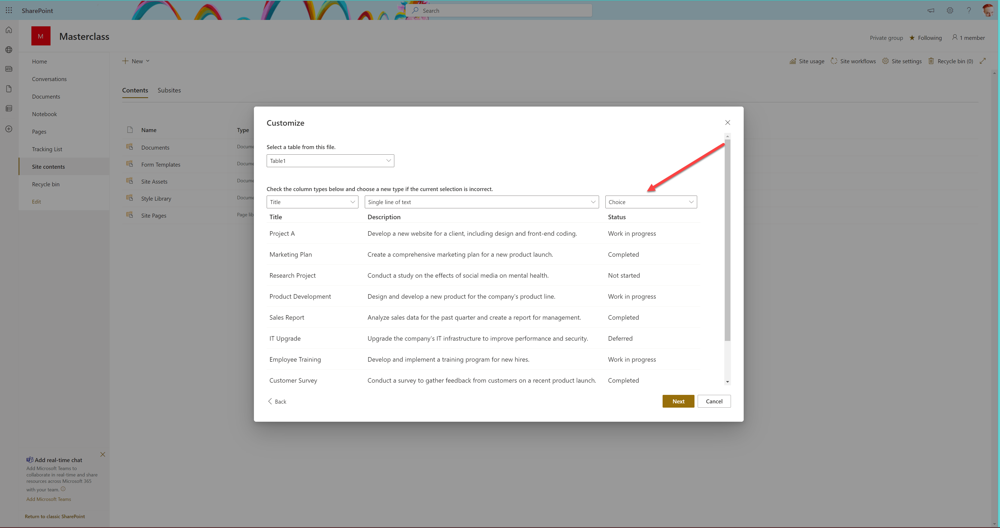
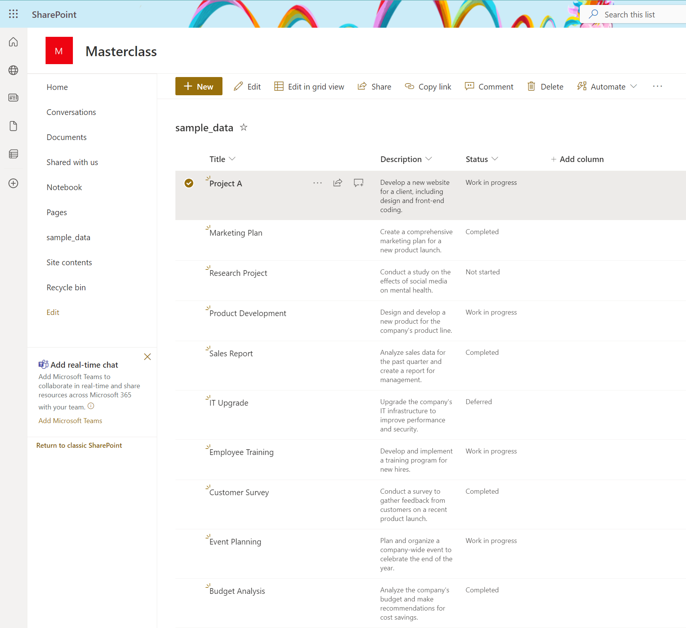

# Task 1 - Import sample data

As we do not wnat to spend too much time on creating tables, data, etc., we conveniently prepared some sample data as an .xlsx file for you, to be found here : [sample-data.xlsx](/assets/sample_data.xlsx)

* Download a copy of this file

## SharePoint list

* Create a list in either an existing SharePoint site or in a new SharePoint site using the **Create from Excel** feature:
  * Open a SharePoint Site
  * Select **Site contents**
  * Select **New** --> **List**
  * Select **From Excel**
  
  * Upload your copy of the **sample_data**
  * Customize so that the **Status** column is of type **Choice**
  
  * Select **Next**
  * Select **Create**

As a result, your list should look like this:

## Dataverse table

* Open your solution
* Create a new table in the solution
  * Primary column: `title`
  * Create a column `description` (multiple lines of text)
  * Create a column `status` (choice) with global choices [Not started", "Work in progress", "Completed", "Deferred"]
