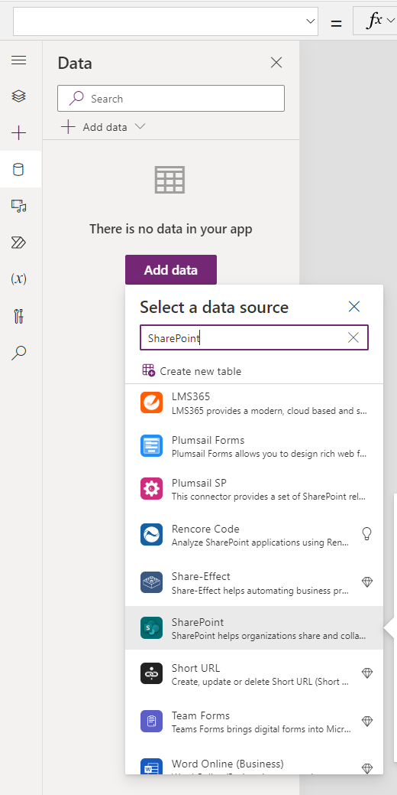
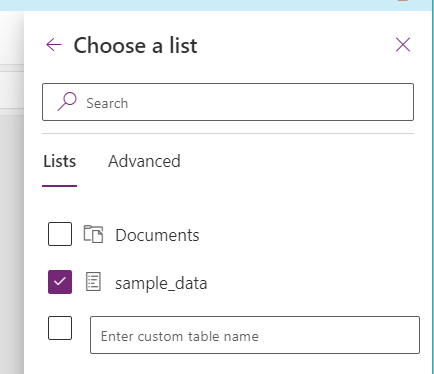

# Task 2 - Patch your SharePoint list

* Open the canvas app in your solution
* Connect the app to the SharePoint list

* Connect the app to the Dataverse table

## Try it out

* open either the Power Apps monitor or the **Network tab** in Edge Developer tools
* Patch data to SharePoint list and to Dataverse
* see the difference!
